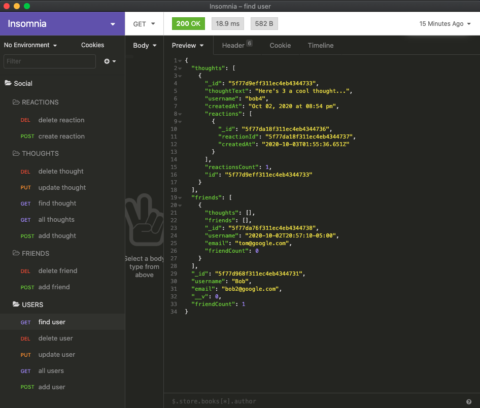

# Social Network API
1. [ Description. ](#desc)
2. [ Questions.](#ques)
3. [ Screenshot.](#scrsh)

## Description:
### API for a social network web application where users can share their thoughts, react to friends’ thoughts, and create a friend list

## Questions:
### My gitHub profile:
## https://github.com/Alex2055
### Email me:
## alexfromnashville@gmail.com

 #
 

    